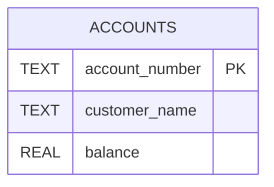

# 🏦 Bank Management System

A simple **Bank Management System** developed using **Python**, **SQLite**, and **Object-Oriented Programming (OOP)**. The project demonstrates account management operations with persistent data storage using SQLite.

---

## 📌 Project Overview

This project simulates a basic banking system where users can create and manage bank accounts. It uses SQLite as the backend database and follows Object-Oriented Programming principles to organize the application logic.

---

## 🎯 Objectives

- Develop a menu-driven banking application.
- Perform CRUD operations on bank accounts.
- Store account information using SQLite.
- Apply Object-Oriented Programming concepts.
- Validate user inputs and handle exceptions.

---

## 🛠️ Technologies Used

- Python
- SQLite
- Object-Oriented Programming (OOP)

---

## ✨ Features

- Create New Account
- View Account Details
- Deposit Money
- Withdraw Money
- Update Customer Details
- Delete Account
- Account Number Validation
- Exception Handling
- Persistent Database Storage

---

## 🗄️ Database Schema

The application uses a single **accounts** table to store customer account information.

| Column | Data Type | Constraint |
| --------- | ----------- | ------------ |
| account_number | TEXT | Primary Key |
| customer_name | TEXT | NOT NULL |
| balance | REAL | NOT NULL |

---

## 🗺️ Entity Relationship (ER) Diagram



---

## 📂 Project Structure

```text
Bank-Management-System/
│
├── bank_management.py
├── bank.db
├── README.md
└── screenshots/
```

---

## 💻 Database Operations

- CREATE
- INSERT
- SELECT
- UPDATE
- DELETE

---

## 📚 Concepts Demonstrated

### Python

- Object-Oriented Programming (OOP)
- Classes and Objects
- Exception Handling
- Functions
- Input Validation
- File Handling (if applicable)

### SQLite

- CRUD Operations
- Primary Key
- Database Connectivity
- SQL Queries

---

## 🎓 Learning Outcomes

Through this project, I gained practical experience in:

- Python Programming
- Object-Oriented Programming
- SQLite Database Integration
- CRUD Operations
- Exception Handling
- Database Management
- Input Validation

---

## 👨‍💻

### Mayur Jadhav

- GitHub: <https://github.com/leox27>
- LinkedIn: <https://linkedin.com/in/mayur-x27>

---

⭐ If you found this project helpful, consider giving it a **Star**.
